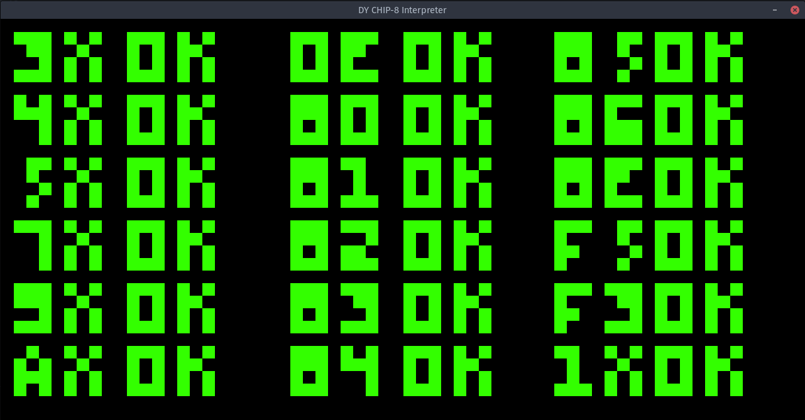
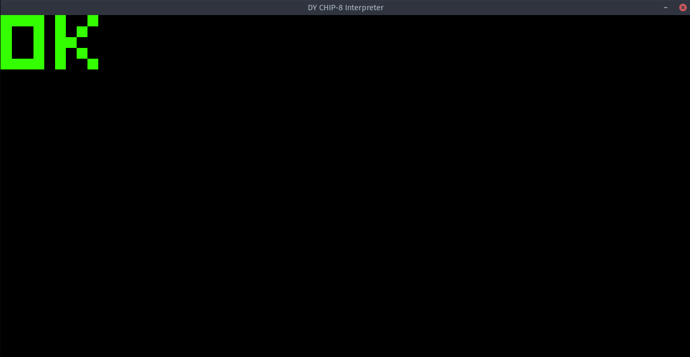
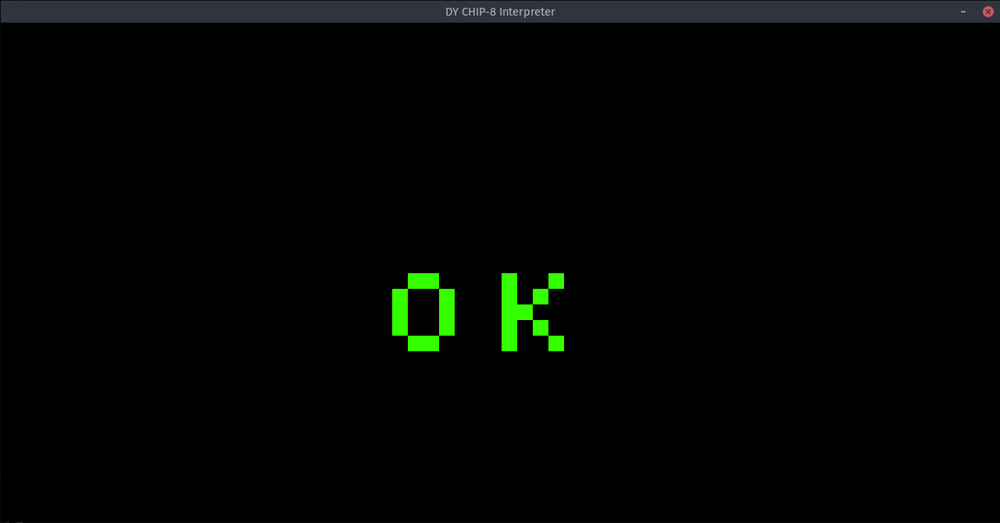
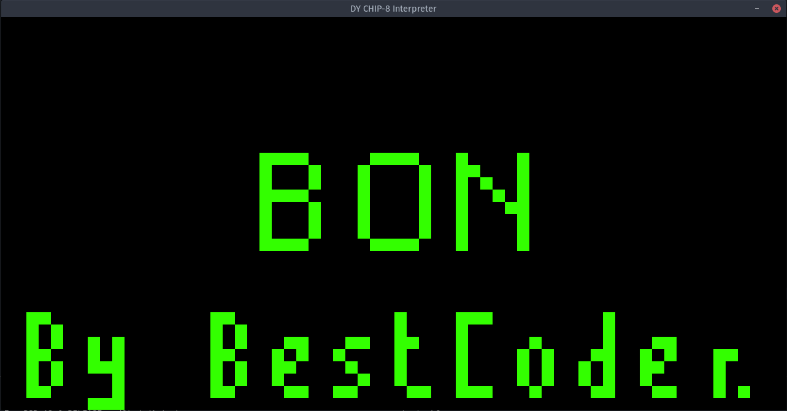

# DY Chip-8

DY is a chip-8 interpreter (emulator) written in C. Graphics, Input, Sound have been implemented with SDL2.

## Features
- Runs at an oddball resolution of 1280*640
- Sound
- Specify core speed at runtime
- Default speed is 700 Hz
- Builtin Debugging to terminal
- Cross Platform

## Showcase

#### [CHIP-8 Test Rom by corax89](https://github.com/corax89/chip8-test-rom)



#### [chip8-test-rom by metteo](https://github.com/metteo/chip8-test-rom)



#### [c8_test rom by Skosulor](https://github.com/Skosulor/c8int/tree/master/test)



#### [BestCoder's Test Rom](https://cdn.discordapp.com/attachments/465586212804100106/482263586547302426/BC_test.ch8)



> [Rom Description](https://cdn.discordapp.com/attachments/465586212804100106/482263582793531423/BC_test.txt)


## Usage

Run with default settings (Assuming installed)
```bash
$ dy <path/to/rom/file>
```

Specify your own arguments
```bash
$ dy <path/to/rom/file> -hz <integral value> -s <path/to/sound/file>
```
example:
```bash
$ dy ~/ROMs/snake.ch8 -hz 1000 -s sound/edited_alarm.wav
```
or
```bash
$ dy ~/ROMs/snake.ch8 -s sound/edited_alarm.wav
```

## Dependencies
- SDL2
- SDL2 Mixer

## Installation

### Windows

- Download/Clone this repository, a compiled version has been provided for windows, you can also compile for yourself using cygwin or mingw provided that you have SDL2 and SDL2 Mixer installed in the include directory of respective compiler.

**Compile using**
- make emu_win

## Linux

### Compile the emulator
- make emu

### Compile the emulator and install
- make emu_install

### Compile the emulator with optimizations
- make emu_opti

### Compile the emulator with optimizations and install
- make emu_opti_install

### Compile the emulator with debugging to terminal and gdb symbols
- make emu_debug

### Compile the emulator with gdb symbols only
- make emu_gdb
